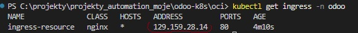
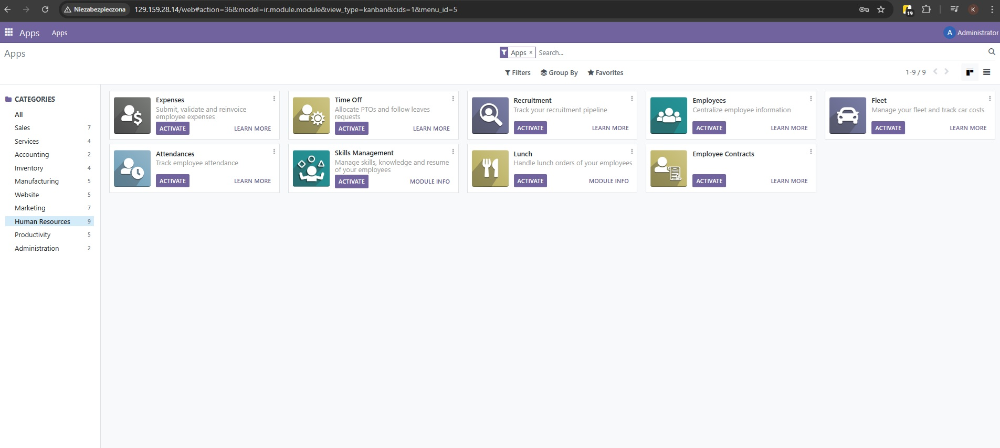

# odoo-k8s
Oddo app runned with kubernetes using GCP kubernetes engine  (GKE) and GCP persistent disk, you can also run it on Oracle Cloud Infrastructure

## How to run this project in Google Cloud Platform GCP :

```
cd gcp
```

- login and auth to google cli 
- connect to your gcp k8s cluster:
```
gcloud auth login
gcloud config set project <your_project_name>
gcloud container clusters get-credentials <your_cluster_name> --zone <your_zone_name> --project <your_project_name>

``` 

#### Then run commands :

```
kubectl create namespace odoo
kubectl apply -f odoo-configmap.yml -n odoo
kubectl apply -f odoo-secret.yml -n odoo
kubectl apply -f odoo-deployment.yml  -f odoo-service.yml -f odoo-pvc.yml -f postgres-deployment.yml -f postgres-service.yml 
```
#### Then install ingress nginx controller :
```
kubectl apply -f https://raw.githubusercontent.com/kubernetes/ingress-nginx/controller-v1.5.1/deploy/static/provider/cloud/deploy.yaml
```
#### Check nginx controller instalation:
```
kubectl get pods -n ingress-nginx -l name=ingress-nginx --watch
```

#### Then apply ingress resource 

``` 
kubectl apply -f ingress.yml 
```

#### Then type and select the value from ADDRESS and paste it in your browser 
```
kubectl get ingress -n odoo
``` 


#### Odoo app default credentials:
 - email: user@example.com
 - password: bitnami


## How to run this project in Oracle Cloud Infrastructure OCI :

```
cd oci
```

- login and auth to oracle cli 
- connect to your oracle k8s cluster :
```
 oci ce cluster create-kubeconfig --cluster-id ocid1.cluster.oc1.eu-frankfurt-1.XXXXXXX --file $HOME/.kube/config --region eu-frankfurt-1 --token-version 2.0.0  --kube-endpoint PUBLIC_ENDPOINT
 ```
#### Then run commands :

```
kubectl apply -f odoo-namespace.yml 
kubectl apply -f odoo-configmap.yml -n odoo
kubectl apply -f odoo-secret.yml -n odoo
kubectl apply -f odoo-deployment.yml  -f odoo-service.yml -f odoo-pvc.yml -f postgres-deployment.yml -f postgres-service.yml 

```
#### Then install ingress nginx controller :
```
kubectl apply -f https://raw.githubusercontent.com/kubernetes/ingress-nginx/controller-v1.5.1/deploy/static/provider/cloud/deploy.yaml
```
#### Check nginx controller instalation:
```
kubectl get pods -n ingress-nginx -l name=ingress-nginx --watch
```

#### Then apply ingress resource 

``` 
kubectl apply -f ingress.yml 
```

#### Then type and select the value from ADDRESS and paste it in your browser 
```
kubectl get ingress -n odoo
``` 



## Dont forget to cleanup :

```
kubectl delete -f ingress.yml 
kubectl delete -f https://raw.githubusercontent.com/kubernetes/ingress-nginx/controller-v1.5.1/deploy/static/provider/cloud/deploy.yaml
kubectl delete -f postgres-deployment.yml -f odoo-deployment.yml  
kubectl delete -f odoo-service.yml -f postgres-service.yml -f odoo-pvc.yml
```

#### Section Notes and Resources
This project contains open source Odoo app image (https://github.com/odoo/odoo). 